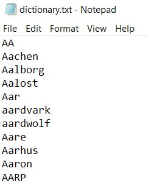
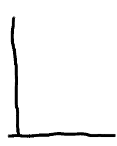
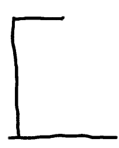
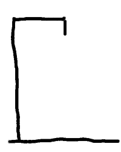
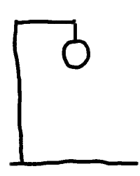
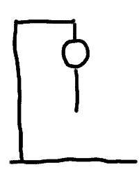
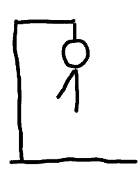
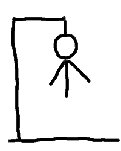
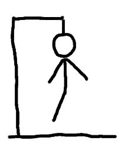
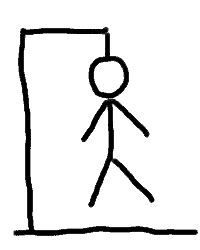

# Hangman

This is a web application which hosts the popular children's game Hangman.

----------------------------------------------------------------------------------------------------------------------------------------

## Table Of Contents

1. Installation Guide
2. How to start the application
3. How to setup the game
4. How to play the game
5. Credit To Authors

----------------------------------------------------------------------------------------------------------------------------------------

## Installation Guide

This application was created using ReactJS. In order to use this application, install Node and NPM onto your machine. Note that when you install Node, you automatically install NPM as well, since Node and NPM are distributed as a single download. It is possible to download Node and NPM [here](https://nodejs.org/en/download/). It is recommended to download the LTS (Long-Term Support) version rather than the latest version. To make sure that you have successfully downloaded Node and NPM, run the following commands in the command line:

- 'npm -v'
- 'node -v'

If they are downloaded, the version numbers for Node and NPM should be returned by the command line. If the version numbers are not returned, attempt to download Node and NPM again.

----------------------------------------------------------------------------------------------------------------------------------------

## How to start the application

To use the application, you need to ensure that the entire project is downloaded. Ensure that all files and directories are downloaded. Once the project is downloaded, open up you command line and navigate the main directory of the project 'my-app'. Once there, type the command 'npm start'. Your browser should open up the project automatically. If your browser does not open the project on its own, then open up your browser and type in 'http://localhost:3000/' in the URL bar. The alternative to typing in 'http://localhost:3000/' is to enter the given IP address shown in your command line into the URL bar in your browser.

----------------------------------------------------------------------------------------------------------------------------------------

## How to setup the game

To setup the game of Hangman, the user must first upload a .txt file consisting of a list of words for the user to guess. To do this, navigate to the 'Upload' tab, and choose a .txt file to upload. Each word in the .txt file should be separated by a line break. Thus, the .txt file should look something like this:

You may use the .txt files given to you under the directory 'my-app/src/input-file/' or you may use any other .txt file of your choice. Please ensure that the .txt file you upload is not empty. If the .txt file is empty, no words will be uploaded, and you will still be unable to play the game.

Once a word list is uploaded, you can generate a random word by navigating to the 'Play' tab and clicking the 'Generate Word' button. From there, you may click on the letters on the right hand side to guess the word you have generated. If you require more details on how to play Hangman, please review the rules below.

----------------------------------------------------------------------------------------------------------------------------------------

## How to play the game

The rules of Hangman are as follows:

- The user must generate a random word.
- Once a random word is generated, blank lines will be shown. These blank lines indicate the allocated spaces for the missing letters that the user needs to guess.
- If the user guesses a letter correctly, the letter will be displayed in one or more of its allocated blank spaces.
- The objective is for the user to keep guessing letters until all the blank spaces are completely filled.
- However, if the user guesses a letter incorrectly, the Hangman image progressively gets drawn line by line. Each time a user guesses a letter incorrectly, another single line will be drawn.
- The user must try to avoid getting a line drawn. If the user manages guess a letter incorrectly 10 times, the Hangman image will be fully drawn and the user will have lost the game.
- Note that a user can only guess a particular letter once. So, if that letter is correct, it will be displayed in all its allocated blank spaces immediately. If that letter is incorrect, the user will not be penalised for clicking the incorrect letter another time within that particular game.

The Hangman image progresses as follows:

| State | Image |
| ----------- | ----------- |
| State 1 (0 wrong answers) |  |
| State 2 (1 wrong answer) |  |
| State 3 (2 wrong answers) |  |
| State 4 (3 wrong answers) |  |
| State 5 (4 wrong answers) |  |
| State 6 (5 wrong answers) |  |
| State 7 (6 wrong answers) |  |
| State 8 (7 wrong answers) |  |
| State 9 (8 wrong answers) |  |
| State 10 (9 wrong answers) |  |
| State 11 (10 wrong answers) |  |

The game will always start at State 1. Each time the user guesses a letter incorrectly, the state increases. If the user manages to reach state 11, then the user has lost the game.

----------------------------------------------------------------------------------------------------------------------------------------

## Credit To Authors

[Dean Gulston](https://github.com/DJGulston)
